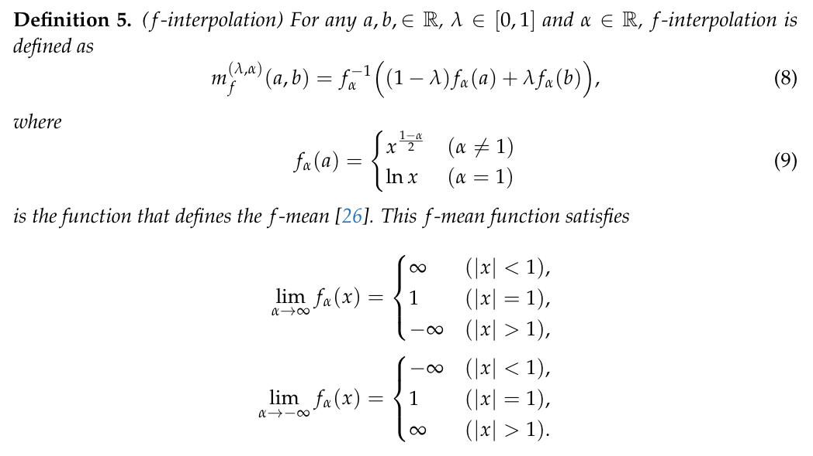
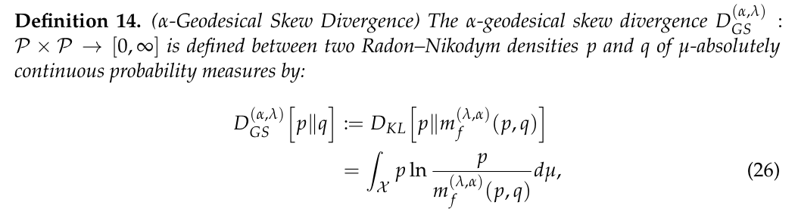
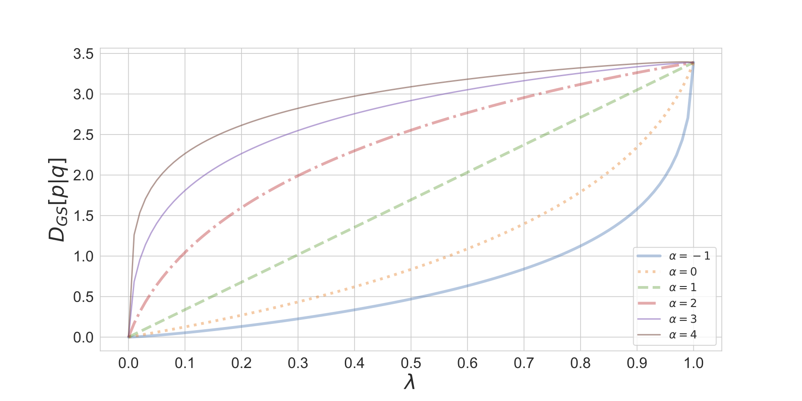
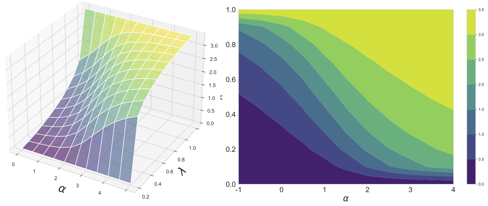

# α-Geodesical Skew Divergence

[](https://github.com/nocotan/geodesical_skew_divergence/blob/main/LICENSE)

Official PyTorch Implementation of "α-Geodesical Skew Divergence".

> The asymmetric skew divergence smooths one of the distributions by mixing it, to a degree determined by the parameter λ, with the other distribution. Such divergence is an approximation of the KL divergence that does not require the target distribution to be absolutely continuous with respect to the source distribution. In this paper, an information geometric generalization of  the skew divergence called the  α-geodesical skew divergence is proposed, and its properties are studied.

## Installation

```bash
$ git clone https://github.com/nocotan/geodesical_skew_divergence
$ python setup.py install
```

## Usage

```python
import torch
from gs_divergence import gs_div

a = torch.Tensor([0.1, 0.2, 0.3, 0.4])
b = torch.Tensor([0.2, 0.2, 0.4, 0.2])

div = gs_div(a, b, alpha=-1, lmd=0.5)
```

| parameter | description                                                                                                                                                                                                                                                                                                                                                                                                                              |
|-----------|------------------------------------------------------------------------------------------------------------------------------------------------------------------------------------------------------------------------------------------------------------------------------------------------------------------------------------------------------------------------------------------------------------------------------------------|
| input     | Tensor of arbitrary shape                                                                                                                                                                                                                                                                                                                                                                                                                |
| target    | Tensor of the same shape as input                                                                                                                                                                                                                                                                                                                                                                                                        |
| alpha     | Specifies the coordinate systems which equiped the geodesical skew divergence (default=``-1``)                                                                                                                                                                                                                                                                                                                                               |
| lmd       | Specifies the position on the geodesic (default=``0.5``)                                                                                                                                                                                                                                                                                                                                                                                     |
| reduction | Specifies the reduction to apply to the output:             ``'none'`` \| ``'batchmean'`` \| ``'sum'`` \| ``'mean'``.             ``'none'``: no reduction will be applied             ``'batchmean``': the sum of the output will be divided by the batchsize             ``'sum'``: the output will be summed             ``'mean'``: the output will be divided by the number of elements in the output             default=``'sum'`` |


## Definition of α-Geodesical Skew Divergence






## Visualizations of the α-Geodesical Skew Divergence

### Monotonicity of the α-geodesical skew divergence with respect to α



### Continuity of the α-geodesical skew divergence with respect to α and λ.


